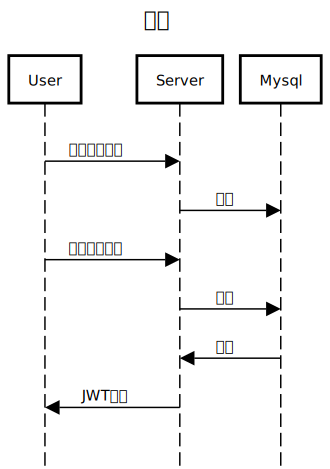

# task_app_server
- タスク管理
- 認証機能

## API

GET /api/tasks 全てのタスクの取得をする   

POST /api/tasks タスクの追加をする   
{ "name" : "掃除"　}　 

PUT /api/tasks タスクを完了させる   
DELETE /api/tasks タスクを削除する   

POST /api/register　ユーザー登録   
{
    "name": "abcd",
    "password": "agdsa43"
}  

POST /api/login JWTの取得

## 使用技術
- Go 1.22
- mySQL
- Echo
- Gorm
- Docker