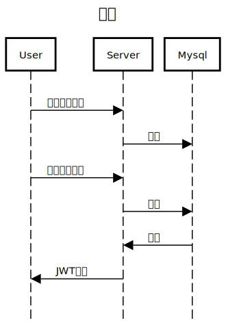

- ターミナル上で
`make app`

# task_app_server
- タスク管理
- 認証機能


## ER図


## API

GET /api/tasks 全てのタスクの取得をする <br> 

POST /api/tasks タスクの追加をする <br> 

```json
  {
    "name" : "掃除"
  }
```

PUT /api/tasks タスクを完了させる <br> 
DELETE /api/tasks タスクを削除する <br> 

POST /api/register　ユーザー登録 <br> 
```json
  {
    "name": "abcd",
    "password": "agdsa43"
  }
```
<br>

POST /api/login JWTの取得

```json
  {
    "name": "abcd",
    "password": "agdsa43"
  }
```



## 使用技術
- Go 1.22
- mySQL
- Echo
- Gorm
- Docker